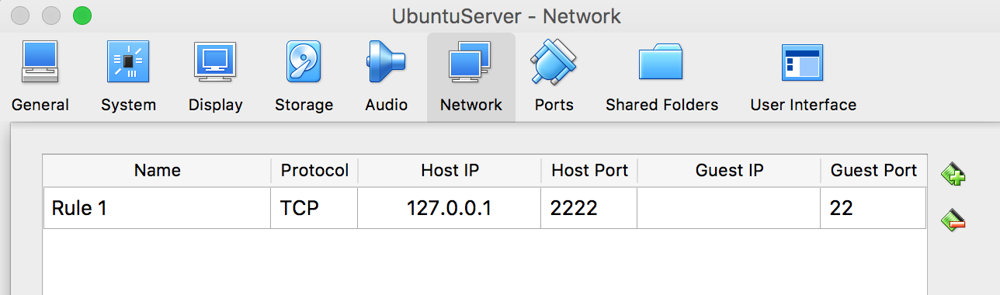

# myrancher

> testing rancher based management for cluster of docker containers

### Installation instructions on Mac (Host Machine)

- Install virutalbox and extension pack

  ````shell
  brew cask install virtualbox
  brew cask install virtualbox-extension-pack
  ````

- Run RancherOS on a virtual box

  ```shell
  $ docker-machine create -d virtualbox --virtualbox-boot2docker-url https://releases.rancher.com/os/latest/rancheros.iso <MACHINE-NAME>
  ```

  - Check if Rancher is running now

    ```shell
    VBoxManage list runningvms | grep <MACHINE-NAME>
    ```

- ssh into the RancherOS

  ```shell
  docker-machine ssh <MACHINE-NAME>
  ```

- Get the IP address of the RancherOS host running in virtualbox

  ```Shell
  docker-machine ip <MACHINE-NAME>
  ```

- Run Rancher server inside of the RancherOS (and forward port 8080)

  ```
  docker run -d --restart=unless-stopped -p 8080:8080 rancher/server
  ```

- Now open a web browser on your machine and go to the ip address of the docker machine

  ```
  http://<ip>:8080
  ```

### Now that the machine is running, lets configure Rancher via its UI

- **Set up Access Control (lets use `GitHub`)**
  - Go to `Admin -> Access Control` and register the application on GitHub following the instructions. (when filling out `homepage url` and `authorization callback url`, make sure to mention the `port number` as well)
  - Copy the generated `Cliend ID` and `Secret` from github to the fields below


- **Set up a Host**

  - Lets first try to add a host. I am using UbuntuServer as a host machine and we shall setup supported version of docker in it

  - Download Ubuntu Server and set up VirtualBox to run it. I have configured it to use 1 processor, 2GB Ram and 16GB hard drive and a shared folder mounted to my local machine.. and.. fire it up.. install stuff (make sure to enable `ssh`)

    - Selecting auto-mount will give a lot of issues as it will try and mount everything as `root` user and changing that in docker is nothing short of a nightmare. So **uncheck auto-mount**

  - Lets install VirtualBox addons (to access shared folder)

    ```shell
    sudo apt-get install build-essential module-assistant
    sudo adduser <username> vboxsf
    sudo reboot now
    ```

    - Check if you can see the shared folder mounted. If not (or if any errors in above execution), then do the following

      ```shell
      sudo mount /dev/cdrom /media/cdrom
      cd /media/cdrom
      sudo ./VBoxLinuxAdditions.sh
      sudo adduser <username> vboxsf
      sudo reboot now
      ```

    - Now lets mount the shared folder

      ```shell
      sudo mount -t vboxsf <shared_folder_name> -o rw,dmode=777,gid=<group_id_of_vboxsf>,uid=<your_user_id> /media/<mount_folder_name>
      ```

      Or add the following to your `/etc/fstab` so that Ubuntu will load it everytime it boots

      ```shell
      <shared_folder_name>                   /media/<mount_folder_name> vboxsf          uid=<of_user>,gid=<of_vboxsf>        0       0
      ```

  - In VirtualBox network set up port forwarding and forward the port 22 to localhost 2222. 

    

  - Lets install docker version that is supported by Rancher ([supported_docker_verions](http://docs.rancher.com/rancher/v1.5/en/hosts/#supported-docker-versions))

    ```shell
    curl https://releases.rancher.com/install-docker/1.12.sh | sh
    ```

  - Also, just in case, disable the ufw firewall (or make sure to keep port `500 `and `4500` open for `IPsec tunneling`)

  - Go to `Infrastructure -> Hosts` select custom and `Copy, paste, and run the command below to register the host with Rancher` and run it in the Ubuntu Server. Then presss `close` and within a few seconds you should see the host pop up (in `Infrastructure -> Hosts`)

- **Adding Service**

  - In my case, I want to add a [jupyterhub/datascience-notebook](https://hub.docker.com/r/jupyter/datascience-notebook/) service to run in UbuntuServer Host. 

  - Map the service's port 8888 to local machine's port 8888 (so that you can simply use your local machine and access that ip and port)

  - In Volumes tab, `add` that shared folder we created (in my case: `/media/sf_shared_storage`) as

    ```shell
    /media/sf_shared_storage:<location_in_container>
    ```

  - Make some changes in Command — 

    - `start-notebook.sh,--NotebookApp.token=''` 

    - `user root`

    - `Environment Variable`

      - | Variable name | Value |
        | ------------- | ----- |
        | GEN_CERT      | yes   |
        | NB_UID        | 1000  |
        | GRANT_SUDO    | yes   |

  - Click **Create**! and go to https://localhost:8888 and you shall be welcomed with the familiar Jupyter dashboard


